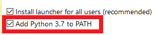
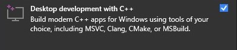
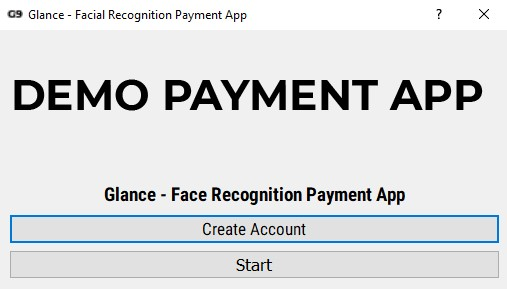

# **Glance - Facial recognition payment app**

This is a DEMO project that use facial recognition to execute payment (with MoMo's API)

Code by @AbsoluteWinter
 
## **Installation**

### **Step 01:**
Install Python 3.7+ (use one of the link bellow)
- [Python 3.7+](https://www.python.org/downloads/release/python-379/)
- [Python 3.7.9 for windows](https://www.python.org/ftp/python/3.7.9/python-3.7.9-amd64.exe)

Remember to `Add Python to PATH`<br/>


### **Step 02:**
Install `Desktop development with C++` in [`Microsoft Visual Studio`](https://visualstudio.microsoft.com/) in order to build `dlib` library



### **Step 03:**
Install additional Python libraries
```bash
pip install -r requirements.txt
```
or
```python
pip install typing_extensions
pip install opencv-python==4.5.5.62
pip install cmake==3.24.0
pip install dlib==19.18.0
pip install face_recognition==1.3.0
pip install PyQt5==5.15.4
pip install pyqt5-tools==5.15.4.3.2
pip install requests==2.27.1
```

### **Optional:**
- [GitHub Desktop](https://desktop.github.com/)
- [VSCode](https://code.visualstudio.com/)
    - [Python extension](https://marketplace.visualstudio.com/items?itemName=ms-python.python)
    - [Pylance](https://marketplace.visualstudio.com/items?itemName=ms-python.vscode-pylance) (Optional)
    - [Code runner](https://marketplace.visualstudio.com/items?itemName=formulahendry.code-runner)

## **Usage**
Run `__main__.py` to run Glance



Create Account first, then Start